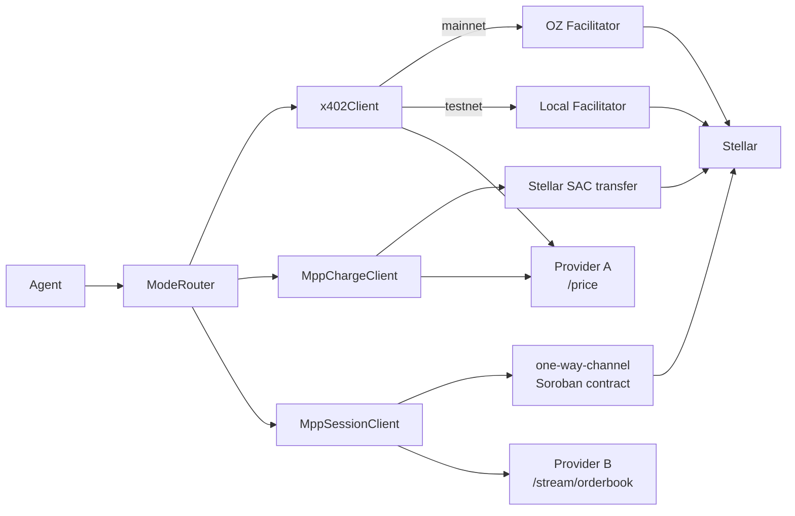

# RouteDock

**Unified payment execution layer for autonomous agents on Stellar**

[](https://www.npmjs.com/package/@routedock/routedock) [](https://github.com/winsznx/routedock/actions/workflows/ci.yml)  

---

## The Problem

Three payment protocols exist on Stellar for agent-to-service transactions: x402 (Coinbase), MPP charge (Stripe/Stellar), and MPP session channels (stellar-experimental). Each has a separate SDK, a separate integration path, and no discovery mechanism. The one-way-channel Soroban contract is unaudited and has no safe integration path. Every agent team hardcodes payment logic per endpoint.

## The Solution

```ts
import { RouteDockClient } from '@routedock/routedock'

const client = new RouteDockClient({ wallet, network: 'testnet' })
const result = await client.pay('https://provider.example.com/price')
// result.mode → 'x402' | 'mpp-charge' | 'mpp-session' (selected automatically)
```

One SDK. One function call. The mode is selected from the provider's `routedock.json` manifest. The agent writes nothing else.

---

## Architecture



---

## Security Architecture

| Layer | Mechanism | Enforcement Point |
|---|---|---|
| Application | voucher monotonic check | `packages/sdk/src/client/MppSessionClient.ts:currentCumulative` |
| Application | manifest schema validation (AJV draft-07) | `packages/sdk/src/client/ModeRouter.ts` |
| Database | monotonic cumulative trigger | `supabase/migrations/*_sessions.sql:enforce_monotonic_cumulative()` |
| Database | RLS on sessions table | `supabase/migrations/*_rls.sql` |
| Contract | daily USDC cap policy | `contracts/agent-vault/src/lib.rs:__check_auth` |
| Contract | endpoint allowlist policy | `contracts/agent-vault/src/lib.rs:__check_auth` |
| Contract | session key expiry | `contracts/agent-vault/src/lib.rs:__check_auth` |
| Contract | one-way-channel signature verification | [`CCK4XOW3YKQUEZFONUTINKMSNW7SNMRQZURME5U3UP7E6WNGK7UHUCAH`](https://stellar.expert/explorer/testnet/contract/CCK4XOW3YKQUEZFONUTINKMSNW7SNMRQZURME5U3UP7E6WNGK7UHUCAH) |

### Security Notice

The one-way-channel Soroban contract (`stellar-experimental/one-way-channel`) has **NOT been audited**. RouteDock wraps it with safe defaults (17280-ledger refund window, durable session store with monotonic invariant, DB-level trigger enforcement). Production mainnet use should await a formal audit.

**Audit Status:**
- Shortlisted auditors: [OtterSec](https://ottersec.com/), [Hacken](https://hacken.io/), [Trail of Bits](https://trailofbits.com/)
- SCF Audit Bank application: Submitted

## Soroban Events

The `agent-vault` contract emits structured events that indexers and Stellar Expert can attest to without parsing tx state changes.

| Event | Topics | Data | When |
|---|---|---|---|
| `payment_authorized` | `(Symbol, payer: Address, payee: Address)` | `(amount: i128, asset: Address, daily_cumulative: i128)` | Each successful auth pass in `__check_auth` |
| `session_settled` | `(Symbol, channel_id: Address, payee: Address)` | `(payer: Address, cumulative_amount: i128, voucher_count: u32)` | Server calls `record_session_settlement` after channel close |

```bash
stellar events --network testnet --start-ledger <LEDGER> --contract-id <VAULT_ID>
```

---

## Live Testnet Transactions

All produced by a single autonomous agent run against two live provider services. No mocks.

| Type | Tx Hash | Explorer |
|---|---|---|
| x402 settlement | `5f603387807faacdc02c71efb74b26091b1be67740f74dfd581d23d643e2db64` | [view](https://stellar.expert/explorer/testnet/tx/5f603387807faacdc02c71efb74b26091b1be67740f74dfd581d23d643e2db64) |
| Channel open (deploy) | `6ceba32ba2cfd7f3145090c2e6f741db65ae4e4116f3204f2c3173b5266b98ff` | [view](https://stellar.expert/explorer/testnet/tx/6ceba32ba2cfd7f3145090c2e6f741db65ae4e4116f3204f2c3173b5266b98ff) |
| Channel close (50 vouchers settled) | `234dcbb34cfb7a086f17474f57cacaa9edee8bc8dee873e8f2b851abc0a29a20` | [view](https://stellar.expert/explorer/testnet/tx/234dcbb34cfb7a086f17474f57cacaa9edee8bc8dee873e8f2b851abc0a29a20) |
| Policy rejection | NO TX — daily cap enforced locally before any broadcast | — |

**50 interactions. 2 on-chain transactions.** The channel close settled the cumulative amount for all 50 vouchers in a single Soroban invocation.

Contracts deployed on testnet:
- Agent vault: [`CAX5IDLC2XHGQSEA2YN3LPLZ7EXLMRXYX3HFJGKFXS6B7OQXBKWO44LT`](https://stellar.expert/explorer/testnet/contract/CAX5IDLC2XHGQSEA2YN3LPLZ7EXLMRXYX3HFJGKFXS6B7OQXBKWO44LT)
- One-way channel: [`CCK4XOW3YKQUEZFONUTINKMSNW7SNMRQZURME5U3UP7E6WNGK7UHUCAH`](https://stellar.expert/explorer/testnet/contract/CCK4XOW3YKQUEZFONUTINKMSNW7SNMRQZURME5U3UP7E6WNGK7UHUCAH)

---

## Install

```bash
npm install @routedock/routedock
```

## Quickstart

```bash
git clone https://github.com/winsznx/routedock && cd routedock
pnpm install

cp apps/provider-a/.env.example apps/provider-a/.env
# Fill in STELLAR_PAYEE_SECRET, SUPABASE_URL, SUPABASE_SERVICE_KEY

pnpm --filter @routedock/provider-a dev
```

Full demo (both providers + agent): see [`docs/AGENT_RUN_CHECKLIST.md`](docs/AGENT_RUN_CHECKLIST.md).

Mainnet rollout: see [`docs/MAINNET_DEPLOYMENT.md`](docs/MAINNET_DEPLOYMENT.md).

---

## Examples

| Example | What it shows |
|---|---|
| [`examples/streaming-orderbook-agent`](examples/streaming-orderbook-agent) | Opens an MPP session to Provider B's `/stream/orderbook`, consumes 100 voucher-backed orderbook updates, prints best bid/ask, spread, and mid price, then closes the session and logs the settlement tx hash. |

Run it with:

```bash
cd examples/streaming-orderbook-agent
pnpm install
pnpm start
```

---

## Three Payment Modes

### x402 — Pay per request

Server returns HTTP 402. Agent signs a Soroban auth entry for a USDC SAC transfer. On mainnet, the OpenZeppelin facilitator verifies and broadcasts. On testnet, the provider runs a local facilitator (same x402 V2 protocol). One request, one settlement.

### MPP Charge — Pay per action

Agent sends a payment intent via the Stellar MPP charge protocol. USDC transfers natively via the SAC — no facilitator, lower fees. Server verifies and returns the response.

### MPP Session — Pay per time

Agent deposits USDC into a `stellar-experimental/one-way-channel` Soroban contract. For each unit of data consumed, the agent signs an off-chain ed25519 commitment (no RPC call, no transaction fee). The channel settles with one on-chain close transaction for the cumulative amount.

#### Dispute Resolution

If a server crashes mid-session, the agent can reclaim deposited funds using the dispute resolution API. Three methods handle the recovery flow:

- **`session.requestRefund()`** — initiates the refund process on the channel contract, starting the refund window (default 17,280 ledgers ≈24h)
- **`session.settleWithLatestVoucher()`** — server-side counter-mechanism to settle the cumulative amount before the refund window expires, using the highest signed voucher
- **`session.getDisputeStatus()`** — returns the channel state: `'open'`, `'in-refund-window'`, `'refundable'`, or `'settled'`

Raises: `RouteDockDisputeError`, `RouteDockChannelStateError`, `RouteDockRefundWindowError`

### Mode Selection

Deterministic, manifest-driven:

1. Sustained access requested + `mpp-session` available → session
2. `mpp-charge` available → charge (lower fees, no facilitator)
3. `mpp-session` available → x402 (facilitator-backed)
4. Nothing available → throw

---

## Discovery: `routedock.json`

Every provider serves `/.well-known/routedock.json`. The SDK fetches and validates it (JSON Schema, AJV) before every call. Agents never hardcode payment logic.

```json
{
  "routedock": "1.0",
  "name": "Stellar DEX Price Feed",
  "modes": ["x402", "mpp-charge"],
  "network": "testnet",
  "asset": "USDC",
  "asset_contract": "CBIELTK6YBZJU5UP2WWQEUCYKLPU6AUNZ2BQ4WWFEIE3USCIHMXQDAMA",
  "payee": "G...",
  "pricing": {
    "x402": { "amount": "0.001", "per": "request" },
    "mpp-charge": { "amount": "0.0008", "per": "request" }
  },
  "endpoints": { "price": "GET /price" },
  "tags": ["price", "stellar", "dex", "orderbook"]
}
```

The Supabase `providers` table indexes manifests with `pg_trgm` trigram search — agents query by capability, not by URL.

---

## Provider Integration

### Express

```ts
import { routedock } from '@routedock/routedock/provider'

app.use('/price', routedock({
  modes: ['x402', 'mpp-charge'],
  pricing: { x402: '0.001', 'mpp-charge': '0.0008' },
  asset: 'USDC',
  assetContract: process.env.USDC_ASSET_CONTRACT,
  payee: process.env.STELLAR_PAYEE_ADDRESS,
  payeeSecretKey: process.env.STELLAR_PAYEE_SECRET,
  network: process.env.STELLAR_NETWORK,
  facilitatorApiKey: process.env.OPENZEPPELIN_API_KEY, // mainnet only
  manifest,
}))
```

### Hono (Cloudflare Workers, Bun, Deno Deploy)

```ts
import { Hono } from 'hono'
import { routedockHono } from '@routedock/sdk/provider/hono'

const app = new Hono()

app.use('/price', routedockHono({
  modes: ['x402', 'mpp-charge'],
  pricing: { x402: '0.001', 'mpp-charge': '0.0008' },
  asset: 'USDC',
  assetContract: process.env.USDC_ASSET_CONTRACT,
  payee: process.env.STELLAR_PAYEE_ADDRESS,
  payeeSecretKey: process.env.STELLAR_PAYEE_SECRET,
  network: process.env.STELLAR_NETWORK,
  facilitatorApiKey: process.env.OPENZEPPELIN_API_KEY, // mainnet only
  manifest,
}))

export default app
```

One middleware. Handles x402, MPP charge, and MPP session. Serves `routedock.json`. Verifies payments. Settles on-chain.

### Testing your settlement callbacks

Provider authors wiring `onSettled` (e.g. a Supabase write) shouldn't have to mock the whole middleware chain or sign real payments to test that callback. `@routedock/routedock/testing` is the `msw`-equivalent for RouteDock providers: a mock middleware that drives your callbacks with synthetic data.

```ts
import express from 'express'
import request from 'supertest'
import { createMockRoutedockMiddleware } from '@routedock/routedock/testing'

const onSettled = vi.fn() // your real Supabase-writing callback under test

const app = express()
app.use('/price', createMockRoutedockMiddleware({ mode: 'x402', payment: 'auto-pass', onSettled }))
app.get('/price', (_req, res) => res.json({ price: '42' }))

await request(app).get('/price').expect(200)
expect(onSettled).toHaveBeenCalledWith(expect.any(String), '0.001', 'x402')
```

- `payment: 'auto-pass'` (default) invokes the callbacks with synthetic data, then runs your route handler. `'auto-fail'` responds `402` and skips both — exactly like a rejected payment.
- `mode: 'mpp-session'` drives the full `onSessionOpen → onVoucher* → onSettled` sequence.
- Override synthetic values via `synthetic: { txHash, amount, channelId, rate, voucherCount }`.
- To test a callback with no HTTP server at all, call `runMockSettlement(opts)` directly — it returns the synthetic settlement record.

---

## Monorepo Structure

```
routedock/
├── packages/sdk/            # @routedock/routedock — npm
├── packages/mcp-server/     # @routedock/mcp-server — MCP server for LLM agents
├── apps/web/                # Next.js 16 dashboard + landing — Vercel
├── apps/provider-a/         # Express price endpoint (x402 + MPP charge) — Railway
├── apps/provider-b/         # Express orderbook endpoint (MPP session) — Railway
├── contracts/agent-vault/   # Soroban contract account — Stellar
├── agent/                   # Reference autonomous agent
└── supabase/                # Schema + RLS + trigram indexes + Realtime
```

---

## Capabilities

| Capability | Detail |
|---|---|
| x402 settlement (testnet) | Local `ExactStellarFacilitatorScheme` — no third-party dependency |
| x402 settlement (mainnet) | OZ hosted facilitator at `channels.openzeppelin.com/x402` with Bearer auth |
| MPP charge settlement | Server-side broadcast via `@stellar/mpp` pull mode |
| MPP session: off-chain vouchers | 50 vouchers verified — each signed as ed25519 commitment, no on-chain tx per voucher |
| MPP session: on-chain close | Single Soroban `close(amount, signature)` settles the cumulative amount |
| Contract account policy enforcement | `__check_auth` daily cap rejects overspend at the Soroban level |
| Dashboard Realtime | Supabase `postgres_changes` subscriptions on `sessions` and `tx_log` |
| Discovery registry | `providers` table with `pg_trgm` trigram indexes for fuzzy capability search |
| npm package | [`@routedock/routedock@0.1.0`](https://www.npmjs.com/package/@routedock/routedock) |
| MCP server | [`@routedock/mcp-server`](packages/mcp-server) — LLM agent integration via Model Context Protocol |
| Network support | `STELLAR_NETWORK=testnet|mainnet` — single env var switches all code paths |

---

## Deployed Services

| Service | URL | Status |
|---|---|---|
| npm package | [`@routedock/routedock`](https://www.npmjs.com/package/@routedock/routedock) | published |
| Agent vault | `CAX5IDLC2XHGQSEA2YN3LPLZ7EXLMRXYX3HFJGKFXS6B7OQXBKWO44LT` | live (testnet) |
| Channel contract | `CCK4XOW3YKQUEZFONUTINKMSNW7SNMRQZURME5U3UP7E6WNGK7UHUCAH` | live (testnet) |
| Dashboard | [routedock.xyz](https://www.routedock.xyz) | live |
| Provider A (price endpoint) | [api-a.routedock.xyz](https://api-a.routedock.xyz) | live |
| Provider B (orderbook endpoint) | [api-b.routedock.xyz](https://api-b.routedock.xyz) | live |

---

## Full Technical Brief

For a detailed walkthrough of the architecture, protocol conformance, security model, and design decisions, see the [Submission Brief](https://github.com/winsznx/routedock/blob/main/docs/SUBMISSION_ONEPAGER.md).

---

## What's next

RouteDock is a **chain-agnostic agent payment protocol with Stellar as its canonical home.** The protocols it unifies aren't Stellar-bound — x402, which RouteDock wraps, was designed multi-chain and already settles on EVM.

The [**Multi-Chain Roadmap**](docs/MULTICHAIN_ROADMAP.md) sketches a `ChainAdapter` interface with the existing Stellar clients as the reference implementation and **EVM (via x402) as the first extension target** — keeping the single-call agent experience (`client.pay(url)`) identical across chains. The plan is additive: the manifest's `chain` field is optional and defaults to `stellar`, so every existing provider and agent keeps working.

---

## License

MIT
